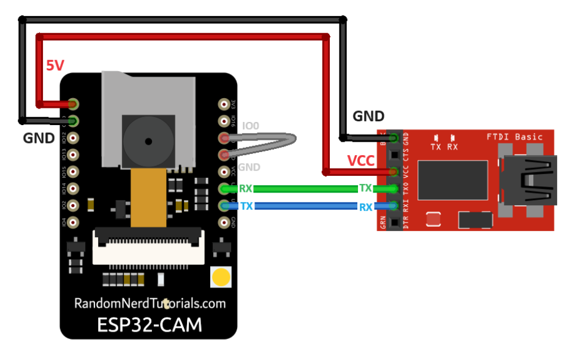
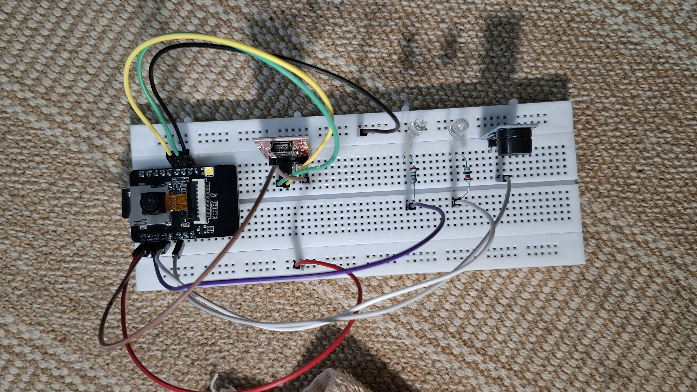
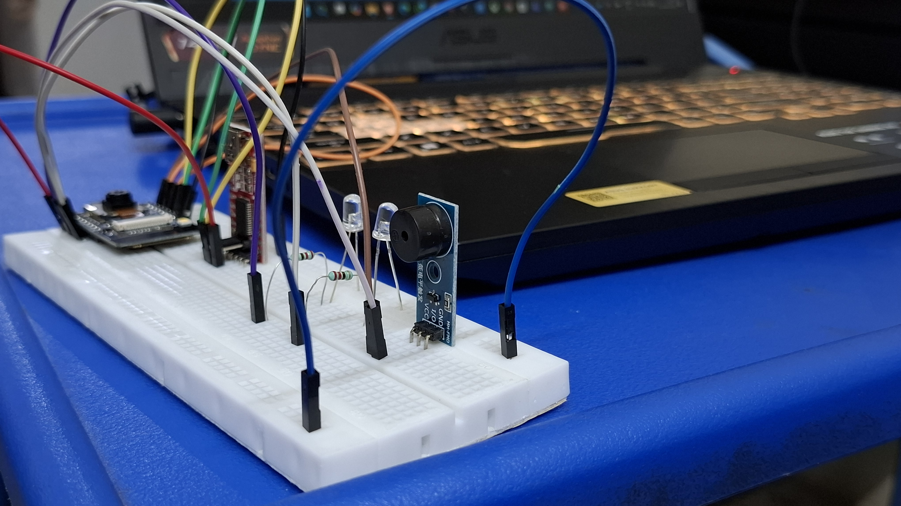
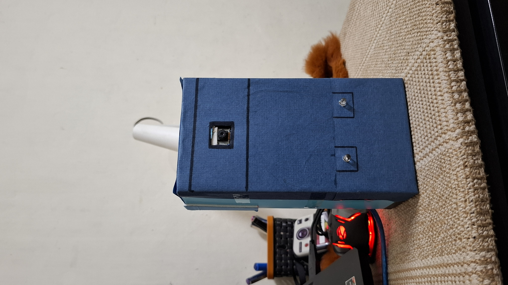
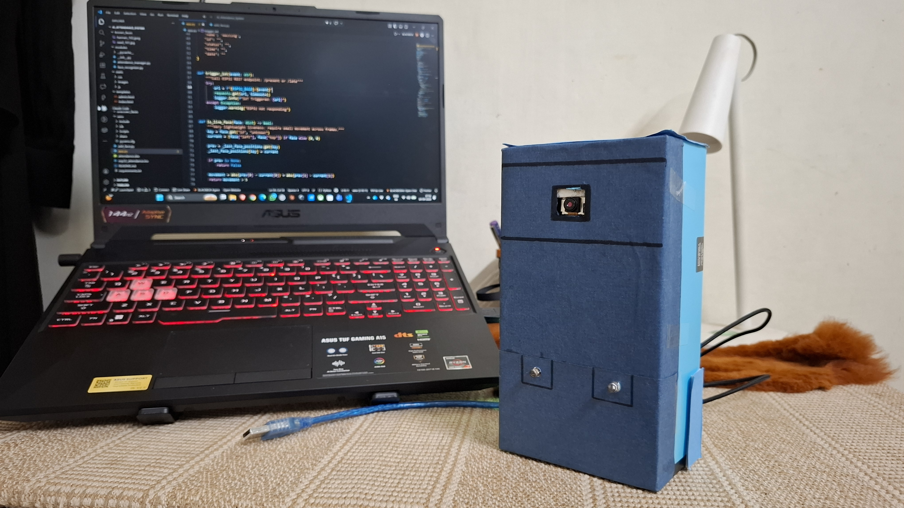
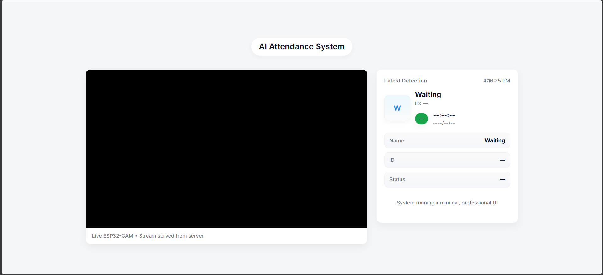

# 🚀 AI Smart Attendance System (Face Recognition + IoT + Anti-Spoofing)

<p align="center">
  
</p>

<p align="center">
  
  
  
</p>

## Description 📝

This project is an AI-powered attendance system that uses advanced face recognition and anti-spoofing techniques to automatically mark attendance. It integrates a modern web-based interface (Flask), deep learning models for face verification, and ESP32-CAM for real-time image capture with IoT interaction.

The system ensures secure attendance by distinguishing real faces from spoofs (photos, screens, masks) and provides real-time feedback through LEDs and a web dashboard.

---

## Features ✨

- 🔍 Real-time Face Detection & Recognition
- 🛡️ Anti-Spoofing Detection (Real vs Fake)
- 📊 Automatic Attendance with Timestamp (Excel)
- 📱 Web Dashboard for Monitoring
- 📹 ESP32-CAM Wireless Streaming
- 💡 LED Feedback (Green = Valid, Red = Invalid)
- ⏰ Time-based Attendance Logic
- ⚡ Optimized Performance

---

## 🧰 Tech Stack 🛠️

### 🎨 Frontend
<p>
  
</p>

---

### ⚙️ Backend
<p>
  
</p>

---

### 🧠 AI / Machine Learning
<p>
  
  
</p>

---

### 📡 IoT Hardware
<p>
  
</p>

---

### 📦 Data & Utilities
<p>
  
  
  
</p>

---

## System Architecture 🏗️

ESP32-CAM → Flask Server → Face Recognition → Anti-Spoof → Attendance
↓
Web Dashboard
↓
LED/Buzzer Feedback

---

## 📁 Folder Structure

```
AI_Attendance_System/
├── app.py                    # Main Flask application + AI pipeline
├── modules/
│   ├── face_recognizer.py   # Face encoding & recognition logic
│   └── attendance_manager.py # Excel handling & duplicate prevention
├── templates/                # HTML templates (index.html, iot.html)
├── static/                   # CSS, JS, profile images
├── known_faces/              # Dataset folders (per person)
├── esp32_attendance.ino      # ESP32-CAM firmware
├── requirements.txt          # Python dependencies
├── attendance.xlsx           # Attendance records (auto-generated)
└── README.md
```

---

## 🚀 Installation
~~~
bash
git clone <your-repo>
cd AI_Attendance_System

python -m venv venv
venv\Scripts\activate

pip install -r requirements.txt
python app.py
~~~

🔌 Hardware Setup & ESP32 Integration
🧰 Components
ESP32-CAM (AI Thinker)
FTDI Programmer
Breadboard & Jumper Wires
Green LED, Red LED
Buzzer
5V Power Supply


## Installation Guide 🚀

### Prerequisites

- Python 3.10.11
- ESP32-CAM with Arduino IDE
- Webcam access (for testing)

### Step 1: Clone & Setup Python Environment

```bash
git clone <your-repo>
cd AI_Attendance_System
python -m venv venv
# Windows
venv\\Scripts\\activate
# Linux/Mac
source venv/bin/activate

pip install -r requirements.txt
````

### Step 2: Prepare Dataset

```
known_faces/
├── Hannan/
│   ├── img1.jpg
│   └── img2.jpg
├── Person2/
│   └── *.jpg
```

Add 2-5 photos per person in separate folders.

## 📦 Model Files

The trained anti-spoofing model is not included in this repository due to size limitations.

You can:

- Train your own model using `train.py`
- Or place your trained model file in:

models/anti_spoof.h5

Make sure the model path matches in the code.

### Step 3: ESP32 Setup

See [ESP32 Setup Instructions](#esp32-setup-instructions) below.

### Step 4: Run Application

```bash
python app.py
```

Open http://localhost:5000

## Usage Instructions 🎮

1. **Live Monitoring**: Visit `http://localhost:5000` for live feed
2. **Attendance Records**: View `/api/records` or dashboard
3. **Manual Entry**: POST to `/manual` endpoint
4. **IoT Panel**: `http://localhost:5000/iot` for LED controls

## Hardware Setup and ESP32 Integration ⚙️

### 1. Hardware Components Used 🛒

- **ESP32-CAM (AI Thinker)** - Main camera module
- **FTDI Programmer (USB to Serial)** - For code upload
- **Breadboard** - Prototyping
- **Jumper Wires** - Connections
- **Green LED** - Valid attendance indicator
- **Red LED** - Invalid/spoof detection
- **Buzzer** - Alert feedback
- **External Power Supply (5V)** - Stable power

### 2. ESP32-CAM to FTDI Wiring Table 🔌

| ESP32-CAM Pin | FTDI Pin | Notes                  |
| ------------- | -------- | ---------------------- |
| GND           | GND      | Ground                 |
| 5V            | VCC (5V) | **5V power required**  |
| U0R (GPIO3)   | TX       | Receive                |
| U0T (GPIO1)   | RX       | Transmit               |
| GPIO 0        | GND      | **Flashing mode only** |

### 3. Important Notes ⚠️

- ✅ **GPIO 0 to GND during upload only**
- ❌ **Remove GPIO 0 connection after upload**
- 🔋 **Use stable 5V/2A power supply**
- ⚠️ **Never use 3.3V for ESP32-CAM power**
- 📶 **Stable WiFi connection required**

### 4. Pin Configuration Used in Project 📍

| Component     | GPIO Pin | Function           |
| ------------- | -------- | ------------------ |
| **GREEN_LED** | GPIO 2   | Valid attendance ✓ |
| **RED_LED**   | GPIO 14  | Invalid/spoof ✗    |
| **BUZZER**    | GPIO 12  | Alert sound        |

**LED Logic**:

- **Green ON** = Attendance marked successfully
- **Red ON** = Invalid face or spoof detected
- **Buzzer** = Invalid detection alert

### 5. Working Flow of Hardware 🔄

1. **ESP32 captures MJPEG stream**
2. **Flask receives frames** for AI processing
3. **AI Pipeline**:
   - Face detection → Anti-spoof → Recognition
4. **Feedback based on result**:
   ```
   VALID → Green LED ON (3s)
   INVALID → Red LED + Buzzer (2s)
   SPOOF → Red LED + Buzzer + Log
   ```

### 6. Code Upload Instructions 💻

1. **Arduino IDE Setup**:

   ```
   Tools → Board → AI Thinker ESP32-CAM
   Tools → Port → Your COM port
   ```

2. **Upload Process**:
   ```
   1. Connect GPIO 0 to GND
   2. Press IO0 + RST buttons (hold)
   3. Release RST, keep IO0 pressed
   4. Click UPLOAD in Arduino IDE
   5. Wait for "Hard Reset" message
   6. Remove GPIO 0-GND connection
   7. Press RST to run
   ```

### 7. Visual Guides 📷

<p align="center">
  
  
  
</p>

<p align="center">
  
  
</p>

**Pro Tip**: Test LED control via `http://YOUR_ESP_IP/green`

## How Attendance System Works ⚙️

1. **Face Detection** → HOG algorithm locates faces
2. **Anti-Spoof Check** → CNN model scores real/fake (threshold 0.5)
3. **Recognition** → Compare encodings vs known database (tolerance 0.48)
4. **Mark Attendance** → Excel append if first entry today
5. **Status Logic** → "Present" (<9AM) or "Late" (>=9AM)

## Anti-Spoofing Explanation 🕵️

Uses MobileNetV2 + custom head trained on:

- **Real**: Live faces, various lighting
- **Fake**: Printouts, screens, replay videos

**Techniques**:

- Laplacian texture variance
- Motion analysis
- Histogram equalization
- Multiple validation frames

Accuracy: ~95% on test set.

## Future Improvements 🚀

- [ ] Mobile app integration
- [ ] Cloud sync (Google Sheets)
- [ ] Multi-camera support
- [ ] Face liveness detection (blink detection)
- [ ] Role-based access (student vs admin)
- [ ] Email/SMS notifications
- [ ] Database migration (SQLite/PostgreSQL)

## Screenshots 📸

<p align="center">   </p> <p align="center">  </p>

## 👨‍💻 Team

### 🚀 Core Development Team

| Name | Role | Responsibilities | Links |
|------|------|-----------------|-------|
| **Mohammed Saad Affan A.** | AI Engineer & System Architect | Designed AI pipeline, face recognition, anti-spoofing integration, system architecture | [GitHub](https://github.com/saad-affan12) \| [LinkedIn](https://www.linkedin.com/in/saad-affan-566553319) |
| **Mohamed Hannan N** | Full Stack Developer | Developed Flask backend, API routes, UI dashboard, system integration | [GitHub](https://github.com/Hannan01-nil) \| [LinkedIn](https://www.linkedin.com/in/mohamed-hannan-9703763a0/) |
| **Rounak Sharma** | IoT & Embedded Systems Engineer | ESP32-CAM setup, firmware development, LED/Buzzer integration, hardware communication | [GitHub](https://github.com/gh-raunil) \| [LinkedIn](https://www.linkedin.com/in/rounak-kumar-9b8260319 ) |

---

### 📌 Contribution Breakdown

- 🧠 **AI Layer** → Face Recognition + Anti-Spoofing  
- ⚙️ **Backend Layer** → Flask APIs + Attendance Logic  
- 📡 **IoT Layer** → ESP32-CAM + Hardware Feedback  
- 🌐 **Frontend Layer** → Dashboard UI  

---

📧 Contact:
- mohamedhannan01@gmail.com  
- saadaffan129@gmail.com
- rounaksharma1221@gmail.com

---

⭐ **Star this repo if you found it useful!**  
📢 **Contributions welcome via pull requests!**
